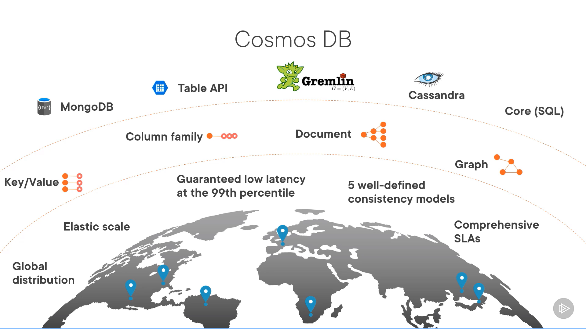
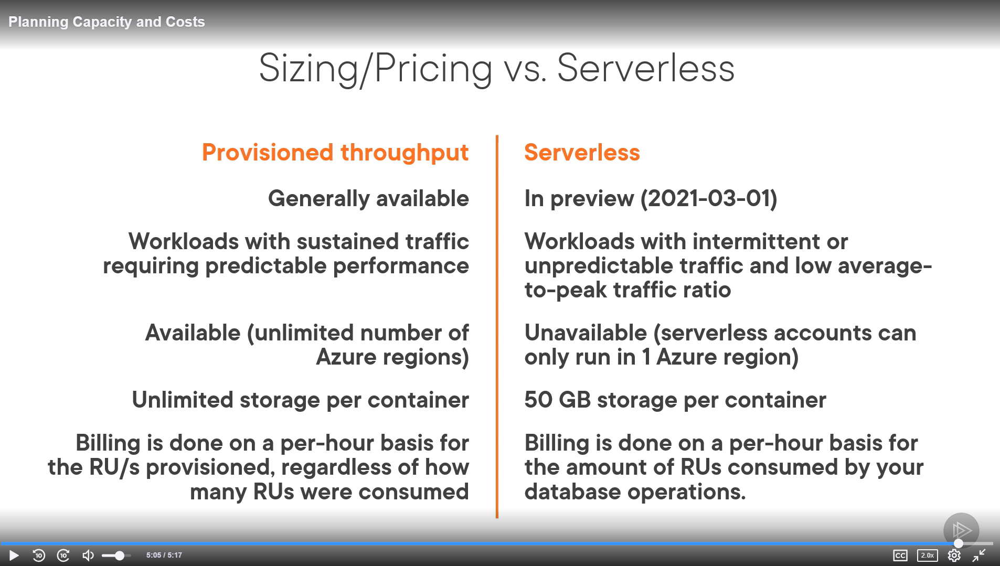

- Data Literacy: Essentials of Azure Cosmos DB
  - 
  - Containers
    - Resource Model
      - Containers (schema agnostic)
        - Collection
        - Table
        - Graph
      - Stored Procedures
      - User-defined functions
      - Triggers
      - Merge procedures
      - Items
        - Documents
        - Rows
        - Node
        - Edge 
        - etc.
  - Planning capacity and costs
    - Costs
      - Request Units (RU)
        - avg of %CPU + %Memory + %IOPS utilised
        - point read of fetching single item by ID and partition key value
          - for 1KB item = 1 RU
    - Planning capacity
      - tool to predict cost
        - basic
          - assuming commonly used settings for parameters
        - Advanced
          - full options with workload mode, indexing policy, consistency
      - Provisioned throughput v.s. Serverless
        - 
  - Tools and SDKs
    - Azure Portal
    - Powershell / Azure CLI
    - ARM Templates
    - SDK
      - .NET
      - Java
      - Spring
      - Node.js
      - Python
    - APIs
      - MongoDB
      - Table
      - Gremlin
      - Cassandra
  - Cosmos DB APIs
    - Core (SQL)
      - default API for Cosmos DB
      - traditional NoSQL document store
      - query using SQLite
      - it uses JavaScript type system, expression evaluation, and function invocation
      - SELECT, FROM, WHERE, ORDER BY, SUM etc.
      - usage: product catalog
    - MongoDB API
      - supports MongoDB Wire protocol
      - allows existing MongoDB client SDKs to interact with data
      - v3.2
      - usage: import historical order data from existing Mongo DB app
    - Cassandra API
      - Cassandra Query Language (CQL)
      - partitioned row store
      - v4 CQL wire protocol
      - CREATE TABLE, INSERT, SELECT, UPDATE, DELETE etc.
    - Table API
      - Azure Table Storage
      - automatically indexes all properties, no index mgmt required
      - Query using Odata and LINQ queries in code, REST API for GET
      - use: IoT data with no relationship information
    - Gremlin API
      - Apache Tinkerpop's Gremlin language
      - graph-based view over data
      - Vertex (Item) and Edge(relationship between items)
      - use: recommendation engine
  - Data Security features and components
      - user authentication and fine-grained user controls
      - Identity and Access Mgmt
        - Account Mgmt
          - global replication
          - virtual network integration, firewall, and CORS
          - regenerate master keys
          - access to monitoring and metrics
          - set account consistency
        - Resource Mgmt
          - create db and containers
          - updating indexing policies
          - set container's throughput (Rus)
        - Data operations
          - CRUD operations
          - Run queries
          - manage and run stored procedures, UDF, and triggers
      - Client and End-Point Protection
        - Configure network security and IP firewall
        - Configure access from Virtual networks (VNet)
        - Configure Azure Private Link for an Azure Cosmos Account
          - private end point = set of private IP addresses in subnet within virtual network
          - private link + restricted network security group policies => reduces risk of data exfiltration
  - Encryption at rest
    - service-managed keys: Microsoft
    - customer-managed keys (Azure Key Vault)
      - register Azure Cosmos db resource provider in azure subscription
      - configure Azure key vault instance and add access policy
      - generate key in Azure Key Vault and create a new Cosmos DB account
- schema changes a lot ==> core (SQL)
- important data about relationships between items in db => graph db
- Simple Key value pairs => Core (SQL) - Cosmos DB, Redis/Table API