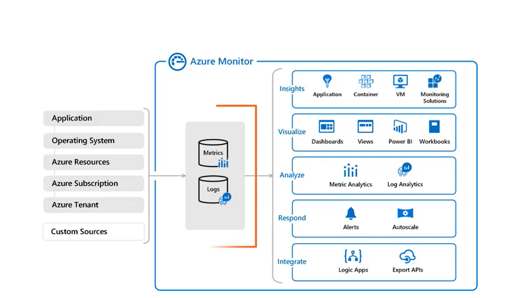
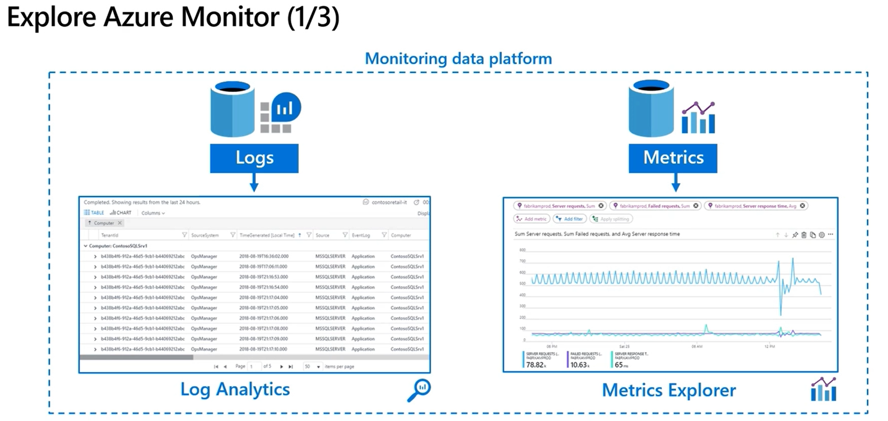
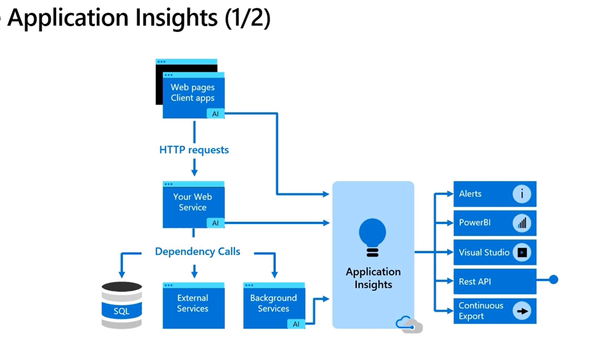

- Azure Monitor and Application Insights
  - Azure Monitor structure
    - 
    - Sources -> Data Store -> Functions of Monitor
      - Sources
        - App
        - OS
        - Azure Resources
        - Subscriptions
        - Tenant
        - Custom Sources
      - Data Store
        - Metrics
          - numerical values describing system state
          - e.g. CPU/Memory usage
        - Logs
          - events that occurred within the system.
          - e.g. exceptions thrown by app
        - 
      - Functions
        - Insights
          - Application
          - Container
          - VM
          - Monitoring Solutions
        - Visualize
          - Dashboards
          - Views
          - Power BI
          - Workbooks
        - Analyze
          - Metric Analytics
          - Log Analytics
        - Respond
          - Alerts
          - Autoscale
        - Integrate
          - Logic Apps
          - Export APIs
 - Azure monitor data collection
    - data about performance and functionality of app's source code
    - data about OS on which app is running
    - data of operations of Azure resources
      - e.g. performance of Azure web app/Azure SQL DB
    - data about operations of tenant-level Azure services, like AAD(Azure Active Directory).
    - can collect data from any REST client including on-premise solutions
  -  
    - def: It is an extensible Application Performance Management(APM) service for developers and DevOps professionals
    - part of Azure Monitor
    - can monitor applications running on the client side as well
    - app is not necessary to be hosted in azure to be monitored
    - capabilities
      - check performance of server machines like CPU or memory usage
      - detect exceptions from app source code
      - add custom metrics and events in client or server code, to track business events
      - collect request rates, response times and failure rates
      - collect page views and load performance - reported by user's browser
      - Correlate infrastructure issues
      - detect and diagnose issues across apps and dependencies
      - support operations with smart alerts and automated actions.
      - create visualization with Azure dashboards and workbooks
    - Monitoring app performance with App Insights
      - Access App Insights data via:
        - Power BI
        - REST API
        - Visual Studio IDE
    - Azure Insights SDK
      - web apps
        - ASP .NET
        - Node.JS
        - ASP.NET core
        - React
        - Java EE
        - Python
      - Desktop and mobile apps - WPF, Android, iOS
        - Visual Studio App center
    - Azure App Insight apps via portal
      - Smart Detection
        - automatically warns of potential performance problems and failure anomalies in web apps
      - Application Map
        - helps spot performance bottlenecks or failure hotspots across all components of the distributed application.
        - gives visualization of requests movement from one component to another.
      - Live Metrics
        - real-time info about app performance, incoming requests, outgoing requests, overall health, CPU usage, memory usage, exceptions rate etc.
      - Failures
        - detects issues, exceptions, server errors, failures etc.
  - Configure Application Insights in Portal
    - portal -> log analytics workspace 
    - portal -> application insights
      - use instrumentation key from here to the app
  - track issues and bugs
  - Configure instrumentation with application insights in ASP.net core web apps
  - Analyze log data and troubleshoot solutions
- Implement Application Insights Web Test and Alerts
  - test and receive automatic alerts when issue is detected
- Implement code that implements alerts and handle transient faults
  - Polly library
  - Implement Retry Pattern and Circuit Breaker
  - Set up recurring tests to monitor availability and responsiveness of your web apps
  - receive automatic alerts when app is not available
    - set up recurring test to monitor availability
    - check if each endpoint is available and can return data
    - types of tests
      - ***URL ping test(classic)***
        - for single URL/endpoint test
        - to validate if an endpoint is responding, and 
          - measure performance associated with that response.
      - ***Standard test***
        - TLS/SSL certificate validity
        - proactive lifetime check
        - HTTP request verb
        - custom headers
      - ***Multistep web test(classic)***
        - to test complex scenarios
          - recording a sequence of web requests, 
          - which can be played back
      - ***custom TrackAvailability test***
        - create a custom application to run availability tests
        - sends availability of an app using TrackAvailability() method form SDK
      - ***Note: classic tests Standard and multistep web tests have been replaced by standard test and customTrackAvailability Test respectively.***
    - Action group
      - collection of notification preferences defined by the owner of an Azure subscription.
      - Azure uses it to notify users that an alert has been triggered.
      - Properties of an action
        - Type: notification or action performed
        - Name: unique identifier of the group
        - Action: additional action like webhook
    - Configure Application Insights Availability tests and alerts in Azure portal
      - Availability Tests
        - portal -> Application Insights -> Availability -> Monitoring -> + Add Test
      - setup tests
        - Applications Insights -> Availability -> Add test
      - Setup alerts
        - Select the test -> 3 dot -> open rules (Alerts page)
      - setup actions
        - select the test -> Actions -> Notifications
  - react on transient failures in code to make solution more resilient
    - Transient faults: 
      - momentary loss of network connectivity to components and services
      - temporary unavailability of a service, or timeout when service is busy
    - challenges to transient faults
      - it can have a huge effect on the perceived availability of an application. so, the following challenges must be overcome by the app:
        - app must be able to detect faults when they occur, and determine if faults are likely to be transient.
        - app must be able to retry the operation if fault is likely transient
        - app must use appropriate strategies for retries which must specify no. of times it should retry.
    - Resilience in the source code
      - Polly open-source library
        - provides retry pattern implementation, timeout and circuit breaker
        - can be integrated with ASP.NET core web apps
        - Retry Policy
          - retries for x no. of times before giving up
          - we should send the request to specific service again, after sometime
          - we should wait before sending next request
          - we can configure retry times and time interval between requests
        - Circuit breaker policy
          - this stops the application(panic button)
          - prevents further attempts to repeat the operation.
          - service is unavailable and can't respond to a request
          - we should avoid sending request for sometime
          - when circuit is opened, no request is sent until it is closed again.
- [configure_app_insights_for_web_app.md](configure_app_insights_for_web_app.md)
- [configure_app_insights_for_web_page.md](configure_app_insights_for_web_page.md)
