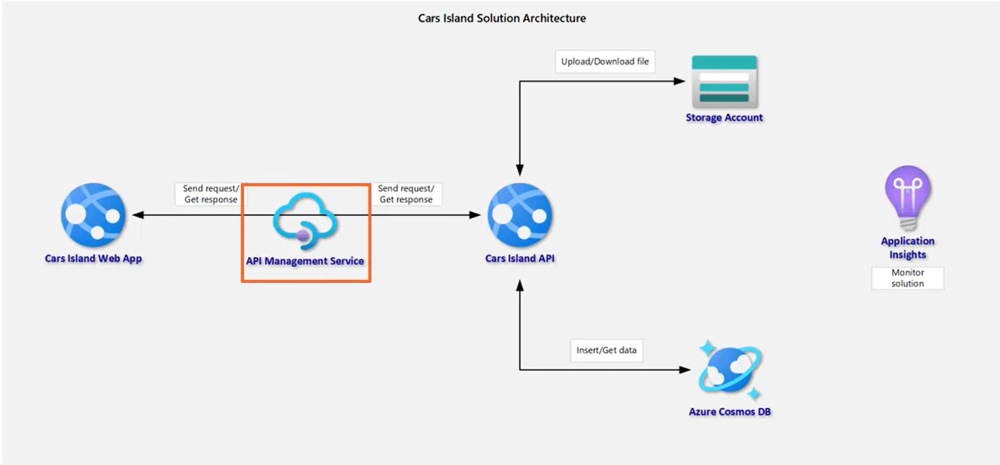
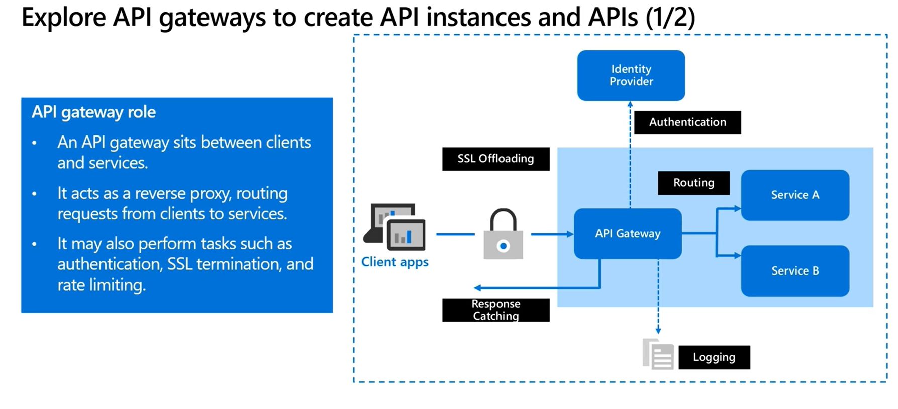

- Azure API Management: github.com/Daniel-Krzyczkowski/Pluralsight
  - 
  - Azure service to create consistent, modern API gateways for existing back-end services.
  - provides secure, scalable API Access for applications.
  - How to design API integration in Azure
  - Components of Azure API Management Service in Azure Cloud
    - Azure API Management structure and its components
      - 
      - 3 components
        - API gateway
          - sits between actual web api and client to provide a layer of abstraction to user from actual api
          - accepts API calls from a client
          - forwards/routes them back to backends(actual web api)
          - it also verifies API keys, JWT tokens, certificates, and other credentials.
          - enforces usage quotas and rate limits.
          - it also caches backend responses.
        - Azure Portal
          - administrative interface to set up API program
          - capabilities:
            - define or import API schema
            - set up policies like quotas or transformations on the APIs.
            - package APIs into products
            - Manage users that have access to APIs
        - Developer portal
          - web user interface to read API documentation
          - capabilities:
            - read API documentation
            - create an account and subscribe to get API keys
            - try API via interactive console
            - access analytics
      - Versions and Revisions
        - Versions:
          - versions allow presenting a group of related APIs to developers.
          - e.g. 
            - https:API/v1
            - https:API/v2
        - Revisions:
          - Revisions allow making changes to API in a controlled and safe way, without disturbing the consumers.
          - e.g. https://api/all;rev=3
        - each version can have multiple revisions. (just like non-versioned API)
        - revisions can be used with or without versions.
        - versions are used to separate API versions with breaking changes while revisions are used for minor and non-breaking changes to an API.
    - Managing APIs with Products and Groups
      - Each API in Azure API Management contains reference to a back-end service that implements API and its operations.
      - Operations in API management are highly configurable
        - control over:
          - URL mapping
          - query and path parameters
          - request and response content
          - operation response caching
          - rate limit quotas
          - API restrictions
      - API access
        - Products and Groups
          - Products
            - how API are surfaced to developers, have one or more APIs, title, description and terms of use.
            - can be open or protected
              - protected products must be subscribed to before they can be used.
              - developers have to first subscribe, get an API key, then use key for API access.
              - if the product is ready to use by developers, it can be published
              - subscription approval is configured at product level.
                - Devs need this sub to access products.
          - Groups
            - used to manage visibility of products to the developers
            - Administrators
              - manage API management service instances, creating APIs, operations, and products.
            - Developers
              - devs are granted access to dev portal and build applications that call operations of an API
            - Guests
              - Unauthenticated dev portal users with read-only access like the ability to view APIs but not call them.
            - Custom groups
              - created by Admin
              - in Azure Active Directory tenants
          - Devs can be created or invited to join by admins or can sign up themselves from dev portal
          - each dev can be a member of one or more group, can subscribe to products to that group
  - Create Azure API Management Instance
    - Configure Azure API Management in Azure Portal
      - portal -> create a resource -> API Management -> APIs -> Add a new API
    - Integrate existing API application with API Management
    - Setup access for developers using developer portal
      - Portal -> API Management service -> Overview -> Developer Portal
    - Publish developer portal
      - Portal -> API Management service -> Portal overview -> Publish
      - Portal -> API Management service -> Products -> Add API
      - Products: one or more APIs, along with usage quota and terms of use
        - Starter
          - Access doesn't require admin approval
          - subscribers can run 5 calls per minute up to max 100 calls per week.
        - Unlimited
          - Access requires admin approval
          - subscribers can have unlimited calls.
  - Protect API from unauthorized use and improve performance with API Management
    - Concept of Azure API Management Securities and Policies
      - Policies
        - allow changing behavior of API through configuration (XML document with inbound and outbound statements)
        - XML document, [policy_structure_sample](policy_structure_sample.xml)
          - inbound
          - backend
          - outbound
          - error
        - collection of statements executed sequentially on request or response of an API.
        - policy is applied between the API consumer and managed API.
        - example usages
          - Format conversions from XML to JSON
          - Restrict the number of incoming calls
          - Enforces existence and/or value of an HTTP header
          - Cache responses according to specified cache control config
        - Categories of policies available in Azure API Management service
          - ***Access Restriction Policy***
            - Limit call rate by key (calls per key e.g. 5 calls per minute)
            - Validate JWT tokens (enforce existence and validity of JWT token in header or query parameter)
            - Set usage quota by key (enforce renewable or lifetime call volume/bandwidth quota)
            - check HTTP header presence (enforce existence/value of an HTTP header)
            - Limit call rate by subscription(limit call rate per subscription)
          - Advanced Policies
            - ***Mock response***
              - return mock response directly to the caller
            - ***Forward request***
              - forward request to backend service
            - ***Retry***
              - retry at specific time intervals
            - ***set request method***
              - allow changing HTTP method for a request
            - ***trace***
              - add custom traces into API inspector output or Application Insights
          - Transformation Policies
            - Convert XML to JSON
            - Convert JSON to XML
            - Find and replace string in body
            - set backend service
            - set query string parameter
              - Add, replace or delete request query string parameter
          - Caching Policies
            - Store responses to cache
            - get previously stored responses from cache
            - Remove from cache
          - etc.
        - Policy scope
          - Global - for all APIs inside API Management
          - Product scope - for all APIs under a product
          - API scope - for single API
          - Operation scope—for single operation
        - Subscription key scopes
          - All APIs
          - Single API 
            - and all of its endpoints
          - Product
            - collection of one or more APIs in API Management(APIM).
          - Note: API management also supports other mechanisms for securing access to APIs:
            - OAuth2.0, Client certificates, IP allow listing
        - Policy execution time [policy_structure_sample](policy_structure_sample.xml)
          - Inbound policies: execute when a request is received from a client 
          - Backend policies: executes before a request is forwarded to a managed service(backend)
          - Outbound policies: execute when before a response is sent to a client
          - On-Error policies: execute when an exception is raised 
    - Configure API Management to accept client certificates
      - Portal -> API management -> Security -> Certificates -> Add
      - Portal -> API management -> APIs -> Policies for inbound processing (</>) -> add policy
    - Protecting APIs from unauthorized access using keys and client certificate
    - Use policies to change the behavior of API through configuration
    - Implement policies like throttling, and caching
      - Implement throttling to prevent resource exhaustion
        - e.g. Inbound policy -> <rate-limit calls="5" renewal-period="10">  (max 5 times in 10s)
      - Improve API performance using caching policy
        - caching methods:
          - Using internal cache provided by Azure API Management service
            - e.g. 
              - Inbound policy
                - <cache-lookup 
                  - vary-by-developer="false" 
                  - vary-by-developer-groups="false"
                  - caching-type="internal">
          - Using Redis Cache
- API Management Pricing tiers
  - ***Consumption***
    - serverless
    - pay per call to API management endpoint instead of per hour
    - automatic scaling built-in
    - shared hardware
    - limited cache support
    - have SLA
    - usage is limited
    - internal cache is not available
    - only redis cache available
  - ***Developer***
    - for testing and validation
    - no SLA
    - support for both cache types: Internal and Azure Redis Cache
    - limited scale-out support
    - provides a level of isolation but not complete isolation
  - ***Basic***
    - has SLA
    - has additional scale-out unit
    - supports larger internal cache
  - ***Standard***
    - has additional scale-out units
    - have SLA
    - larger internal cache
    - adds in Azure AD integration
  - ***Premium***
    - increased SLA
    - larger cache
    - more scale-out units
    - provides multi-region deployments
  - ***Isolated***
    - premium tier + complete compute isolation
- Controlling access to APIs
  - default header name is ```Ocp-Apim-Subscription-Key``` 
  - Access restriction
    - limit access to API
      - check http header for existence and value
      - limit call rate by subscription and key
      - restricted by IP address
      - usage quotas per key
      - validate JWT
  - authentication
    - verify the credentials of API caller
      - Basic Auth: username and password
      - Client Certificate Auth
      - Managed Identity Auth
- API gateway to create API instances and APIs
  - Issues when deploying an API without a gateway
    - complex client code
    - create coupling between the client and backend
    - single operation may need to call multiple services
    - every public-facing service must be dealt with
    - services must expose a client-friendly protocol.
  - Functional design patterns
    - ***Gateway routing***
      - use gateway as a reverse proxy to route requests to one or more back-end services
    - ***Gateway aggregation***
      - use gateway to aggregate multiple individual requests into one request.
    - ***Gateway Offloading***
      - use gateway to offload functionality from individual services to the gateway, 
      - particularly cross-cutting concerns.
- Note: Swagger tool can be used to document API
- Secure API by using subscriptions
  - call an API using a subscription key
    - keys can be passed in request header, or as a query string in the URL
    - default header name is ```Ocp-Apim-Subscription-Key```
    - use developer portal to test out API calls
  - Secure APIs(client to API Management) using client certificates
    - validate certificates presented by connecting client
    - check certificate properties against desired values using policy expressions.
