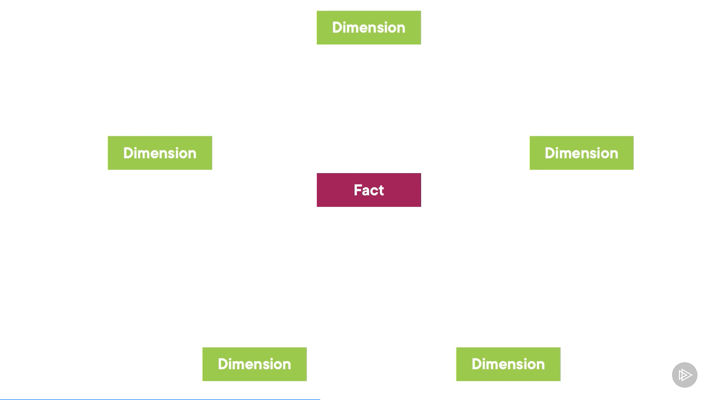

- Data Literacy: Essentials of Power BI
  - Power BI
    - Suite of business analytics tool
    - connects to various data sources
      - Excel
      - Relational
        - SQL
      - Non-relational
        - NoSQL
      - Analysis servers
      - Power BI datasets
      - web page
    - transforms and cleans data
    - share insights across all types of devices
  - Key components of Power BI
  - Exploring Interactive and paginated reports
    - Interactive reports
      - filtering
      - highlighting
      - drilling through data
      - drag and drop for creating visuals
  - creating content in Power BI desktop
    - Power Query: Getting data + cleaning
      - import and reshape data
      - uses M language
    - Getting data
      - Import data
        - copies data to Power BI file
        - data is also published when the report is published
        - fast querying
        - data must be manually refreshed
      - Direct Query
        - without copying data
        - takes data schema: structure of tables and column names
        - only required data is retrieved
      - Live connection
        - not even schema is copied
      - Dual/Composite
        - some data is imported, some queried
    - Model
      - PowerPivot/DAX engine
        - star schema
        - 
          - tables are fact or dimension table
            - Fact table
              - describe something that happened at a certain point in time
              - has metric attached to it that can be aggregated
              - e.g., Sales table
            - Dimension table
              - describes business entities
              - used to group or filter data
              - each dimension is linked to fact table using keys
              - e.g., product name, store name
    - Visualize
      - charts and reports
      - Q&A visual
        - NLP questions about data
      - decomposition tree visual
        - breaks down measure across multiple dimensions
    - Publish reports
  - Data modeling
    - designing data models
      - Star schema
      - DAX
        - Data Analysis Expression
          - language used to calculate measures, columns, and custom tables
  - Power BI for developers
    - based on open-source Javascript libraries
      - for custom connectors and custom chart types
      - embedding charts and reports on websites
  - Power BI Report Builder
    - for printing reports
    - called Paginated reports
      - descendant of SQL Server Reporting Service (SSRS)
      - 

