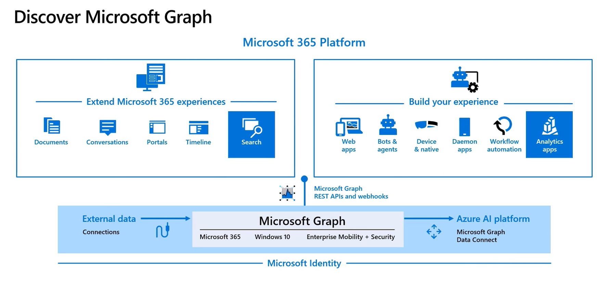

- 
  - https://docs.microsoft.com/en-us/graph/overview
  - What is?
    - gateway to data and intelligence in M365, win10 and enterprise mobility + security.
    - can be used with
      - Office 365
      - Excel
      - query Win 10
      - Calendar
      - enterprise mobility + security
      - User's Mail
    - provides unified programming model to access data.
    - uses single endpoint, https://graph.microsoft.com to access data and insights in microsoft cloud
    - use REST Api or Graph SDK to access endpoints and build apps that support M365 scenarios
    - Application that can be worked with graph:
      - M365 core services/ office-365
        - Bookings
        - OneNote
        - Teams
        - Outlook and Exchange
        - OneDrive
        - SharePoint
      - Enterprise mobility + security services
        - Advanced Threat Analytics
        - Advanced Threat Protection
        - Azure Active Directory, Identity Manager and Intune
      - win 10 services
        - OS Activities
        - Devices
        - OS notifications
        - Universal print functionality
      - Dynamic 365 Business Central
        - Management of financial data
        - Management of projects
        - Automation and securing of supply chain
        - Optimization of operations
        - Sales management
        - Improved customer service
    - Concrete app suggestions:
      - look at meetings and provide profile info of attendees
      - scan calendar and suggest free time slots
      - automated bot for Microsoft Teams
      - alert if too much time spent on meetings
  - Using Microsoft Graph(https://developer.microsoft.com/en-us/graph/graph-explorer)
    - Using REST APIs
    - Using Microsoft Graph SDKs
      - Android
      - Angular
      - ASP.NET
      - JavaScript
      - Node.js
      - Java
      - PHP
      - Python
      - Ruby
      - PowerShell
      - Azure CLI
  - Graph Explorer
  - Use Microsoft Graph in .net app
  - Common functions in Microsoft Graph API
    - Authentication
      - M Graph uses OAuth 2.0 for authentication
      - we need to obtain access token to make authenticated API calls.
      - common endpoints: ```/oauth2/token, /oauth2/v2.0/token```
    - Accessing User Data
      - profile info
      - mail
      - calendar
      - contacts 
      - onedrive files etc.
      - common endpoints: ```/me, /users/{id}, /me/mail, /me/events, /me/contacts, /me/drive``` etc.
    - Working with groups
      - m365 groups and security groups
      - ```/groups, /groups/{id}, /me/memberOf``` etc.
    - Managing files and folders
      - ```/me/drive, /me/drive/root/children, /me/drive/items/{id}```, etc.
    - working with messages and mailboxes
      - ```/me/messages, /me/mailFolders, /me/mailFolders/{id}/messages,``` etc.
    - working with calendar events
      - ```/me/events, /me/calendarView, /me/calendars/{id}/events,``` etc
    - working with contacts
      - ```/me/contacts and /me/contactFolders.```
    - managing users and directories
      - ```/users, /users/{id}, /me/people, etc.```
    - Microsoft Teams and collaboration
      - ```/teams, /teams/{id}, /me/joinedTeams, /teams/{id}/channels,``` etc
    - sharepoint sites and lists
      - ```/sites, /sites/{id}, /sites/{id}/lists, /sites/{id}/lists/{id}/items,``` etc.
    - [common_graph_functions](common_graph_functions.md)
- Microsoft Graph Best Practices
  - Authentication
    - HTTP Authorization request header, as a Bearer token
    - graph client constructor, when using Microsoft Graph client library
  - Consent and Authorization
    - use the least privilege
    - use the correct permission type based on scenarios
    - consider end user and admin experience
    - consider end user and admin
    - Generally,
      - All app level permissions require admin consent.
      - some delegated permissions also require admin consent.
        - e.g. ```people.read.all```
  - Handle responses effectively
    - pagination
      - divide data into pages if we receive a lot of data back from Microsoft Graph.
    - evolvable enumerations
    - Storing data locally
