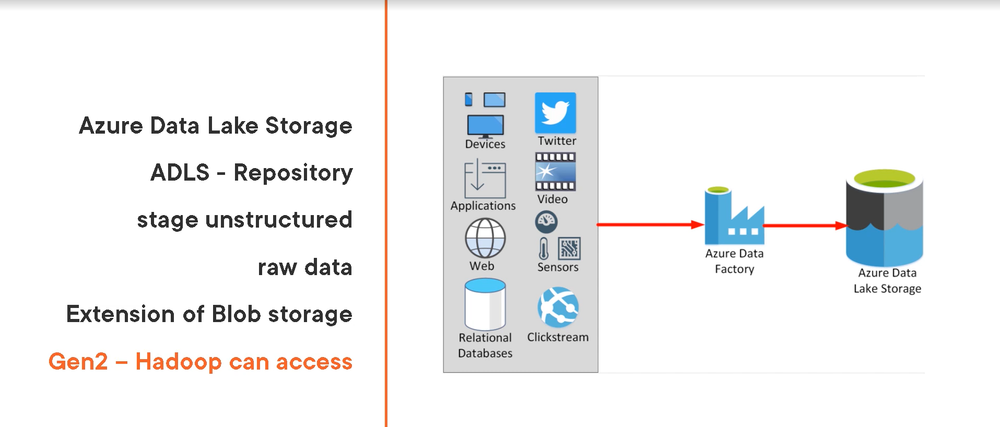
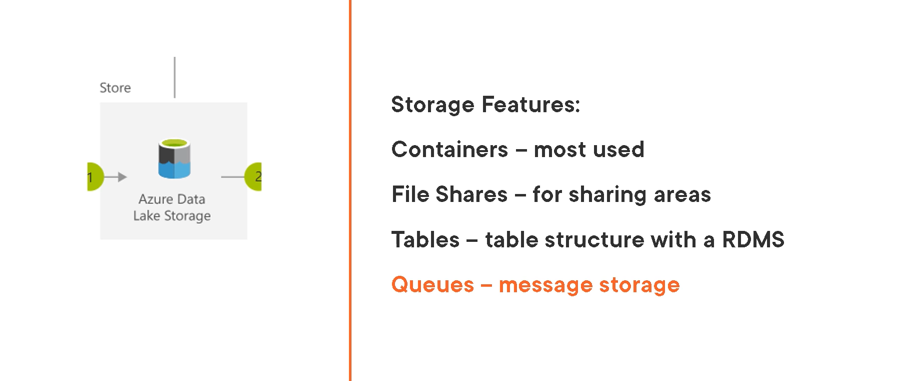
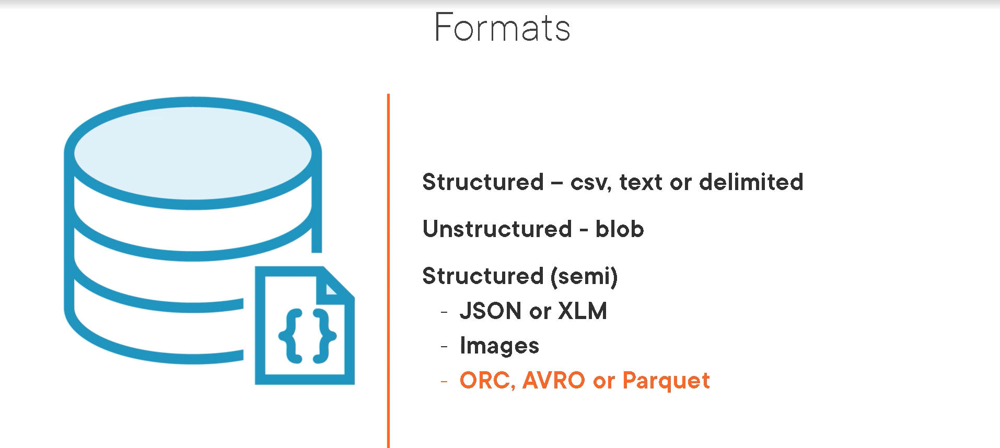
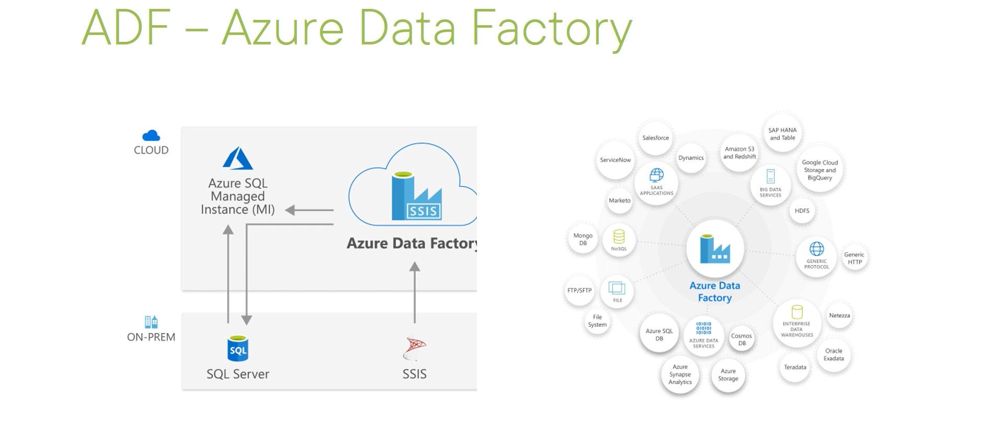
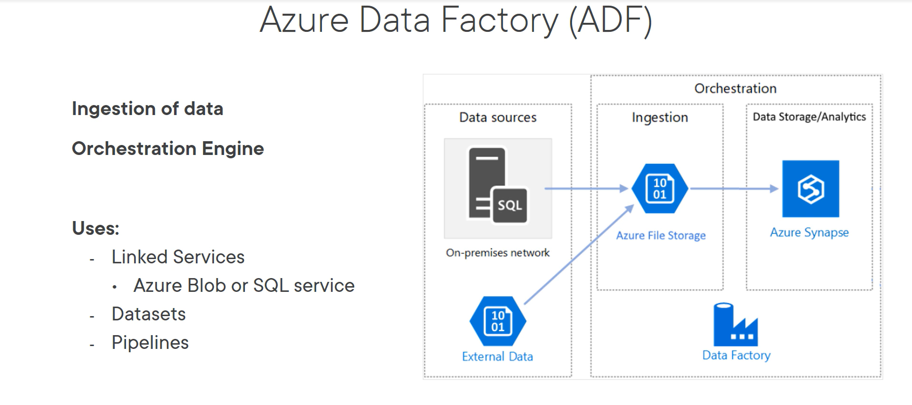
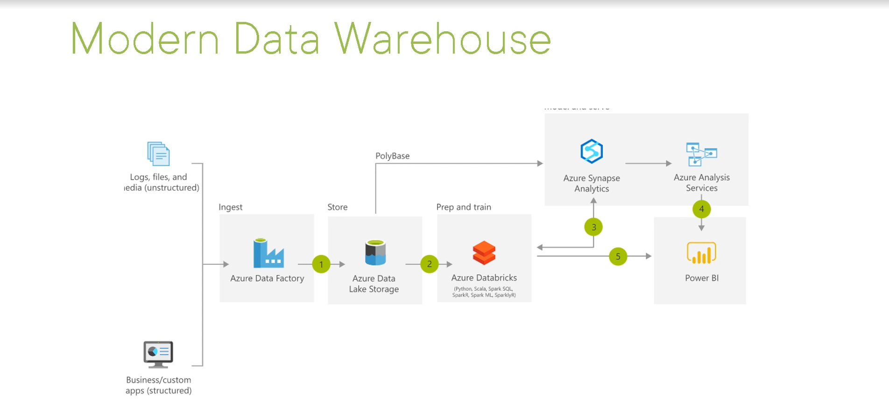
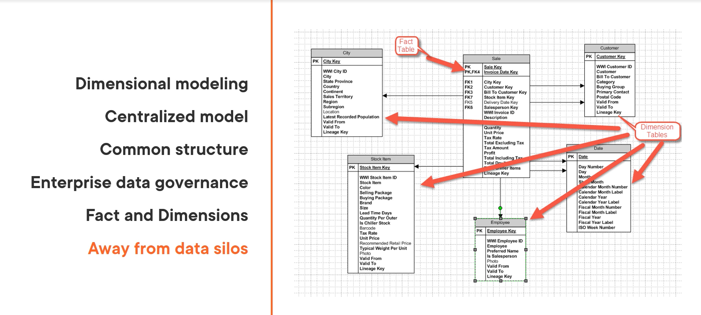

- Data Literacy: understanding Data Warehousing with Azure
  - Azure Data Lake Storage
    - Gen2 (StorageV2)
    - 
    - 
    - 
  - Azure Data Factory
    - movement/Orchestration of data
    - Azure Portal -> Data factories -> overview -> author and monitor
    - 
    - 
  - Synapse Analytics
    - MPP: Massive Parallel Processing system
    - distributed system
    - analytics on large data
    - Notebooks
    - workspace Database Warehouse analytics workspace
      - Storage
      - Compute
      - SQL
      - Spark
      - orchestration of ADF
      - visualizations with Power BI
  - Azure Databricks
    - in-memory data
    - Managed Apache Spark engine
    - Notebook development
    - Spark cluster
    - Apache Spark
      - Machine Learning with Spark, R or Python
      - Graph Processing
      - Stream Analysis
    - Azure Portal -> Azure Databricks -> Launch workspace -> Clusters 
  - Azure Analysis Services and Power BI
  - Services
    - Hadoop - Azure HDInsights
- 
- Analyzing, Slicing and Dicing Data
  - Overcoming Limits with Azure Analysis Services
    - Flavors of analysis services
      - On-Premises
        - part of SQL server enterprise (install locally on server)
      - Azure Analysis Services
      - Power BI datasets
- Enterprise Analytic Database
  - OLAP
    - multidimensional cube
  - Semantic Model
    - Tabular (column store compression)
  - Data Flows
    - BI
      - data and analysis
  - Azure portal -> Analysis Services ->  
- 
- Fact table: Sales
- Dimension tables/relationships
  - employee
  - customer
  - date
  - etc.
