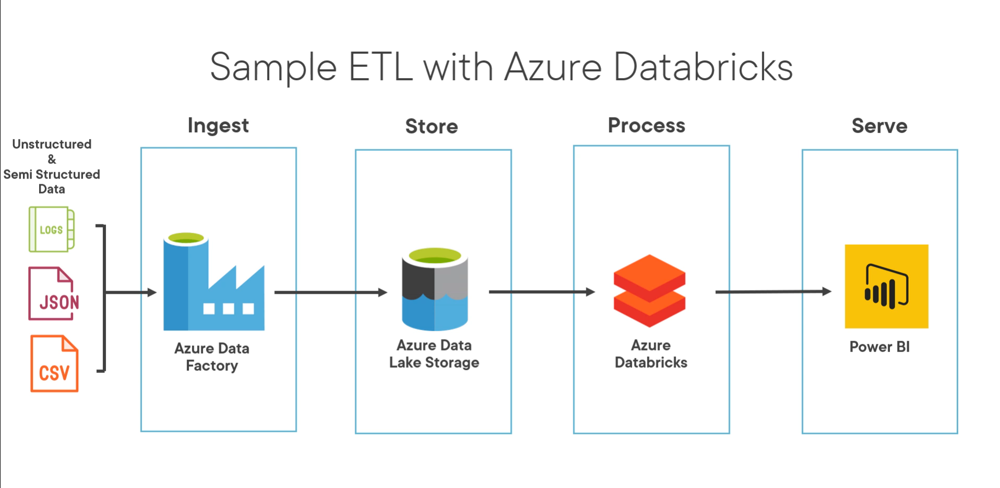
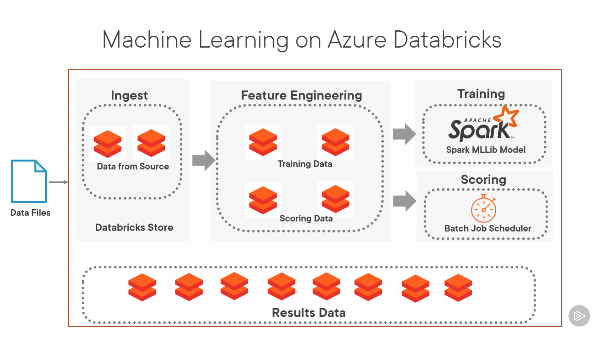
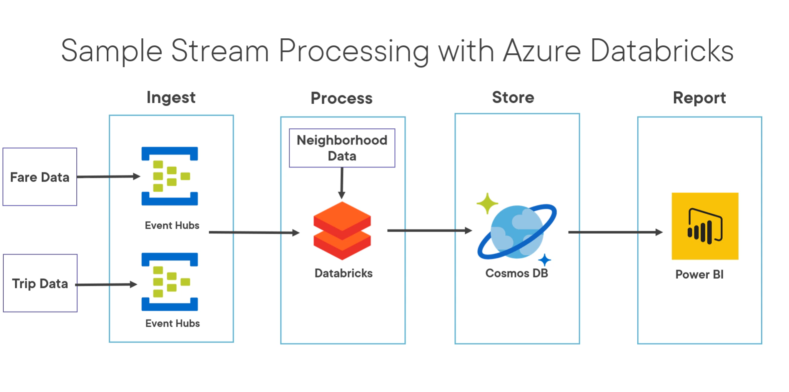

- Essentials of Azure Databricks    ~ Ifedayo Bamikole
  - Key Components of Azure Databricks
    - Workspace
      - Apache Spark interactive workspace
        - for exploration and visualization
    - Cluster
      - Apache Spark Cluster
      - computer engines to run workloads
        - can be created in seconds 
        - auto-scalable
          - resources are allocated based on the job being run
        - can be shared across users
      - can be auto-terminated
        - after a certain amount of inactivity
    - Notebook
      - Apache Spark Notebooks
        - used to read, 
          - write, 
          - query, 
          - explore and
          - visualize datasets
      - Notebooks can be connected to a cluster
        - to run items within notebook
      - save, share, import and export notebooks in workspace
  - Data ingestion and processing
  - Capabilities of Azure Databricks
    - ETL
      - Azure Data Factory - data cannot be stored here
        - 90+ connectors
          - can grab data from
            - Azure
              - Azure Storage
              - Azure Databases
              - other data services
            - Other cloud providers or on-prem servers
            - relational, SQL, noSQL etc.
        - Pipelines
          - schedule as a job
        - for storing data
          - use Azure Data Lake Storage
    - ML
      - automates creation of clusters
        - optimized for ML
      - Integrates with commonly used open source libraries like:
        - Spark MLlib
        - TensorFlow
        - PyTorch
        - Keras
        - XGBoost
      - install python package using conda package manager
      - MLflow
        - manages end-to-end ML lifecycle
          - model creation
          - monitor
          - tracking experimental runs
          - deploying and sharing models
          - maintaining copy of the model that can be accessible easily
      - Azure ML Studo
        - import Azure ML package into the databricks library
        - creates iteration of models as experiments
        - combines with Azure DevOps to operationalize models
          - and build and segment them into containers for easy access to end users
    - Streaming
      - Structured Streaming
        - built on top of Spark SQL Engine
        - introduced in Spark 2.0
          - Improvement from Apache Spark Streaming
        - Handles continuously streaming data
        - fault-tolerant process
        - leverages DataFrame API
        - can be queried with any SQL query
        - use cases
          - Sensors
          - IoT
          - social networks, etc.
  - Features of Azure Databricks
    - Streaming apis with low latency, ML, Graph API, SQL/DataFrames
    - Supports multiple languages: Scala, Python, Java, R, SQl
    - Integration with Azure Active Directory(AAD)
    - Integration with Azure Services like Azure Data Factory, Azure Storage
    - Fulfils Industry Security Compliance like PCIDSS, FedRAMP, etc.
- Azure Databricks workspace
  - what is it
  - how data can be ingested in it
- Databricks
  - data and AI company
  - founded in 2013
  - original creators of the open-source tools:
    - Apache Spark
    - Delta Lake
    - MLflow
- Simple ETL with Azure Databricks architecture
  - unstructured and semi-structured data (Logs, Json, CSV)
    - Ingest (Azure Data Factory) -> Store (Azure Data Lake Storage) -> Process (Azure Databricks) -> Serve (Power BI)
    - 
- Sample ML architecture
  - data files -> Ingest (Databricks Store) -> feature engineering ---> training (Spark MLLib model) and scoring (Batch Job Scheduler)-> result data
  - 
- Sample Streaming architecture
  - Data -> Ingest (Event Hubs) -> Process (Databricks) -> Store (Cosmos DB) -> Report (Power BI)
  - 
