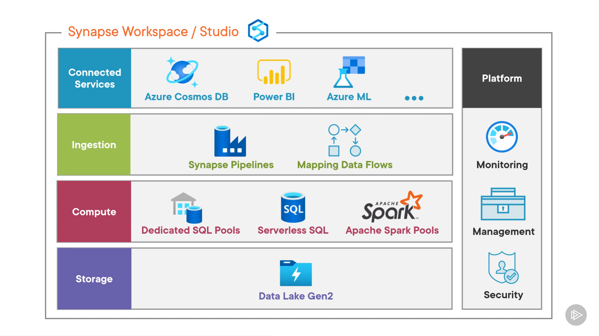
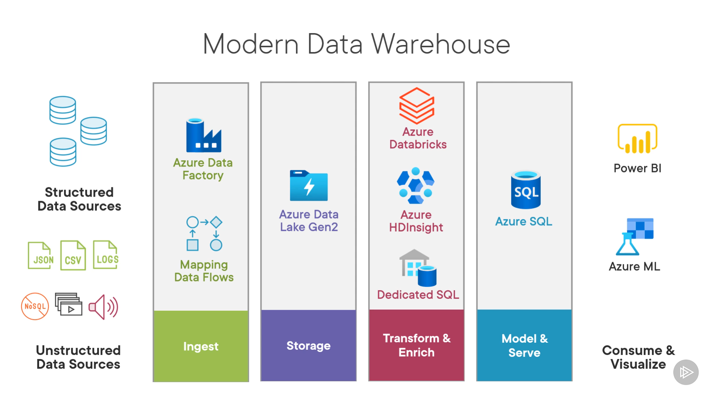
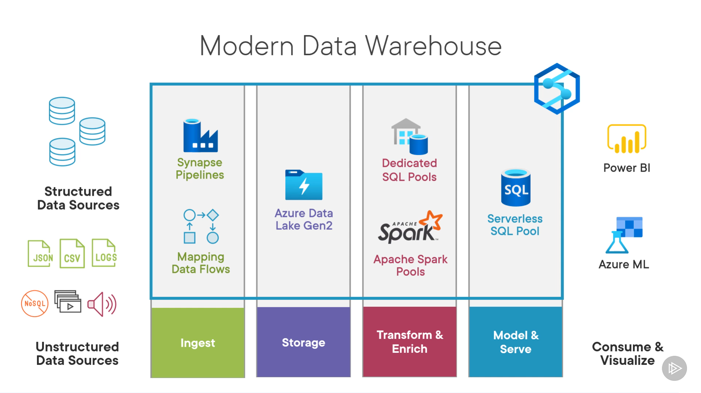
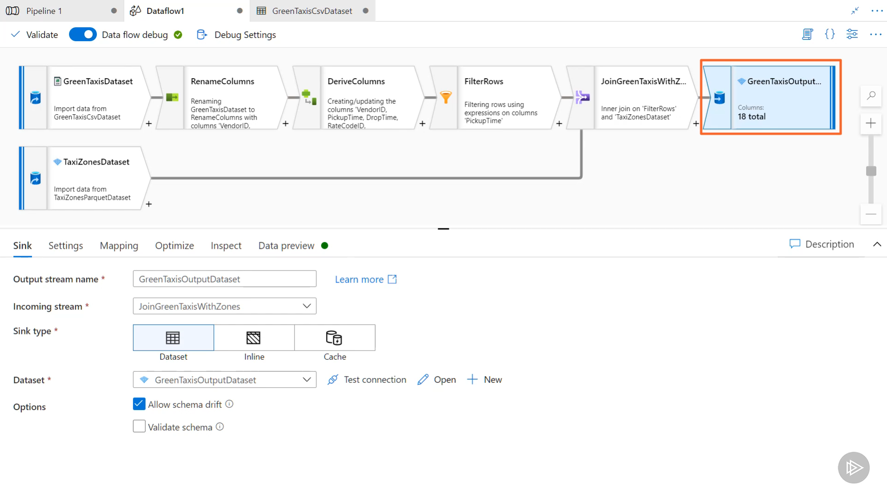

- Essentials of Azure Synapse Analytics
  - Azure Synapse Analytics
    - umbrella of highly integrated, 
    - multiple azure data services
    - Unified Analytics Service that brings together:
      - Data integration(Data Ingestion)
      - Enterprise Data Warehousing(Data Enrichment)
      - Big data Analytics(Data Serving)
  - Architecture and components
    - 
    - Storage
      - Data Lake Gen2
        - one account is mounted by default
        - multiple data sources can be attached
          - Azure Storage
          - Data lake Gen2
          - Cosmos DB etc.
        - Built-in storage explorer
    - Compute
      - Dedicated SQL Pools
        - create multiple Massive Parallel Processing Architecture(MPP)-based databases within synapse
        - Build reliable data models, store data and process data using T-SQL
        - it is a pre-provisioned resouce
          - i.e., need to pay even if not in use if it is running
      - Apache Spark Pools
        - Spark: open source in memory engine for distributed data processing
        - can create spark clusters for big data processing
        - use cases
          - Batch processing, Streaming, ML, Analytics
        - it is also a pre-provisioned cluster
      - Mapping Data Flows
        - visually create ETL pipelines
        - do code-free transformations
        - need spark clusters
        - pre-provisioned resource
      - Serverless SQL
        - allows connecting to external data sources like:
          - data lake, cosmos db, etc.
          - can run federated queries using T-SQL
        - allows exploring external data and build logical data warehouse
        - pay by amount of data processed by your queries
    - Ingestion
      - Synapse Pipelines
        - Shares code with Azure Data Factory
        - copy data from a variety of external sources
          - Salesforce, SAP, AWS
        - build and orchestrate end-to-end pipelines
      - Mapping Data Flows
        - Code free transformations
        - Ingestion of data
    - Connected Services
      - Azure Cosmos DB
        - query directly using synapse compute
      - Power BI
        - build reports with integrated power BI workspace
      - Azure ML etc.
        - integration with Azure Cognitive Services
        - do ML using re-build Azure Cognitive Services
        - Build and Consume own ML models inside workspace
      - Azure Purview
      - Azure SQL etc.
    - Platform
      - Monitoring
      - Management
      - Security
  - Building modern data warehouse
    - using synapse services
  - Ingesting, Transforming and orchestrating
    - with synapse pipelines
      - data integration tool allows creating data-driven workflows
      - i.e., ETL tool in the cloud
      - Process
        - Ingest
          - using COPY activity supports 90+ connectors
        - Transform
          - code free, using spark-based Mapping Data Flows
        - Orchestrate the end-to-end pipeline
          - automate data movement and processing of data
            - using pipelines and control flow activities
  - Processing data
    - with dedicated SQL pool and apache spark tools
      - Dedicated SQL Pool
        - earlier known as Azure SQL Data Warehouse
        - Like SQL server db
          - with Massive Parallel Processing (MPP) architecture
          - elastically scalable compute and storage separately
          - pause or resume service to save cost
        - MPP architecture
          - Control Node
            - brain of dedicated SQL pool
          - Multiple Compute Nodes
            - provides computational power
          - Azure Storage
            - data split in chunks called distributions
        - working
          - User -> Query -> control node (break query into smaller queries)-> compute node -> run queries against distributions in parallel -> compute nodes combine output -> control node (result)-> user
        - Use cases
          - build Reliable Data Model
            - in SQL environment
            - create tables, views, and procedures
            - insert, update and delete data in tables
          - build Analytical Reports
            - using T-SQL
        - Component
          - Polybase
            - allow read and write data stored in external storage
            - using T-SQL commands
            - supports Azure Blob Storage and Data Lake Store
            - allows multiple compute nodes to parallely process files
            - supports formats like CSV, Parquet etc.
  - Transforming Data 
    - with Synapse Spark Pool
      - 
  - Querying data
    - using serverless SQL tool
- modern data warehouse
  - 
- Using Synapse
  - 
- mapping data flow example:
  - 
