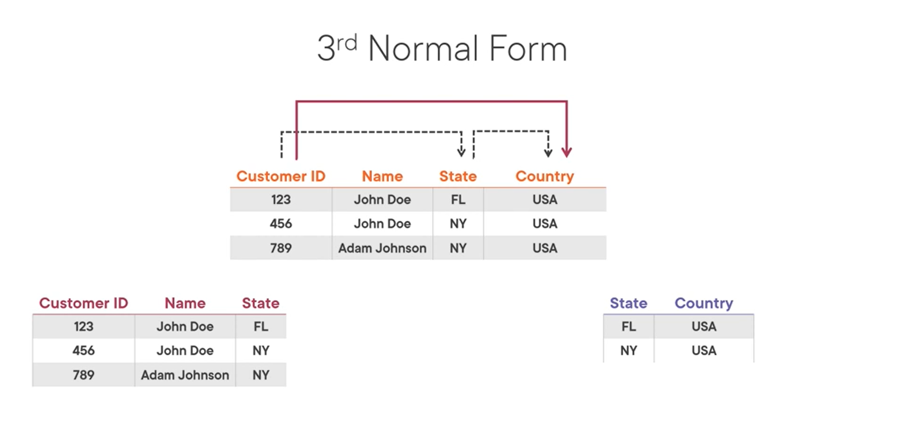

- Relational data with Azure
  - Azure SQL DB Available options
    - Single DB
    - Elastic Pool
    - Managed Instance
  - Normalization
    - process of organizing data in a database
      - Avoid redundancy within tables
      - set consistent table dependencies through relationships
    - why normalize?
      - redundant data waste space
      - and cause maintenance problems
      - 3NF(3rd normal form) is considered necessary
        - eliminates transitive dependency
        - 
          - user is related to state and
          - state is dependent on country
          - hence, user is transitively dependent on country
          - it is better to separate tables with state and country and manage them separately
            - for faster processing and removing redundancies
    - transactional databases
  - OLTP(Online Transaction Processing) system vs. OLAP(Online Analytical Processing) system
    - OLTP
      - OLTP useful for:
        - high volume of transactions (millions of transactions per day)
        - support for quick insert, update and delete statements
        - useful for running simple ad-hoc queries
        - focuses on data integrity
      - applications
        - banking solutions
        - flight reservations
        - e-commerce apps
      - OLTP follows ACID properties:
        - A: Atomicity
          - each transaction is a single unit
          - which can be either completely successful or unsuccessful
          - i.e., if any statement in transaction fails, the whole transaction fails
        - C: Consistency
          - valid state to another
            - e.g., deduct from A, add in B
        - I: Isolation
          - DB to be in the same state when multiple transactions are processed concurrently
          - as if they were executed in sequence
        - D: Durability
          - transaction once committed, remains committed
          - even after the whole system fails afterward
    - OLAP
      - use case
        - understand big picture of db
          - agggregate data
      - Process
        - Data Ingestion
          - capture raw data 
          - from different sources of data: Iot devices, DBs etc 
          - to Repository
            - Database
            - or File Storage System
        - Data Transformation
          - clean data into SQL
        - Data analysis
          - Query
            - Direct Query
              - Ad-hoc SQL data
            - Reporting
          - Visualize data
            - Bar charts
            - Pie charts
            - etc.
            - Visualization Tools
              - Power BI
              - Tableau
              - Qlik
  - Types of Azure Delivery Models
    - IaaS(Infrastructure)
      - IaaS cloud = servers + network + os + storage (data center)
      - Azure 
        - Azure VMs
        - Storage Accounts
      - use cases
        - test and development
        - hosting websites
        - backup, recovery, storage
        - big data analytics
    - PaaS(Platform)
      - OS, Software updates
      - Azure
        - Azure SQL DB
        - Cosmos DB
        - Synapse Analytics etc.
      - IaaS + Middleware
        - development tools
        - PI services
        - DBMS
      - Use cases
        - use built-in software components for Development Framework
        - Analytics
          - data mining, data analysis
        - Extra services
          - directory, workflow, scheduling
          - enhance apps
    - SaaS(Software)
      - ready-made apps
        - Outlook, Calendar, Office365 etc.
  - Connecting and Querying Relational DBs in Azure
    - PaaS solution
    - popular RDBMSs
      - Azure SQL DB
        - Single DB
          - charged per hour
        - Elastic Pool
          - multiple databases share same resources(pool)
            - pool = storage + memory + processing power
        - Managed Instance
          - full control over security and resources
          - used to lift and shift on-prem SQL server to cloud
          - Features
            - Linked servers
            - Service Broker
            - Database Mail
          - Depends on:
            - Azure Storage for backup
            - Azure Event Hubs for telemetry
            - Azure Active Directory for authentication
      - Azure DB for MySQL
        - based on community edition of MySQL
        - automated backups and restore
        - automated maintenance for os and db engine
        - elastic scaling
        - built-in high availability
        - cost optimization
        - single server deployment mode
          - fully managed db service
          - auto backups, patching, high availability etc
          - mySQL v5.6(retired), 5.7, 8.0
          - 3 pricing tiers
            - Basic
            - General Purpose
            - Memory Optimized
          - Azure Portal -> Azure Databse for MYSQL servers -> Create Database
            - Create server
            - set firewall rule
              - Settings -> Connection security -> Firewall -> Allow access -> add clt ip address
            - connect to server
              - powershell -> `mysql --host=server_name --user=username -p`
            - Create Db
              - `CREATE DATABASE db_name`
              - `USE db_name`
              - `quit`
      - Azure DB for MariaDB
      - Azure DB for PostgreSQL
        - PostgreSQL
          - Hybrid relational-object database
          - can store both relational and non-relational data
            - using custom data types to find entity properties
          - can store and handle geometric data
            - circles
            - lines
            - triangles etc.
          - uses pgSQL for querying
            - similar to Oracle PL/SQL
        - limitation in Azure
          - write stored procedures only in pgSQL
          - not allowed to interact with os directly
        - 2 deployment models
          - Single-server
          - Hyperscale(citus)
            - optimal for large DBs (100GBs or more)
            - enables horizontal query scaling across multiple nodes
        - Azure_sys database
          - view: qs_view (query_store.qs_view)
            - query about query to fine-tune them
        - Azure portal -> Azure DB for postgresql -> create server
          - `psql --host=servername --port=5432 --username=uname --dbname=postgres`
  - Querying SQL Database
    - DDL
      - Data Definition Language
      - create and modify database objects
      - CREATE, ALTER, DROP, RENAME -> table, view, procedure, function
      - CREATE
        - `CREATE DATABASE db_name`
        - `USE db_name`
        - `CREATE TABLE table_name(col1 SERIAL PRIMARY KEY,
        col2 VARCHAR(50) NOT NULL ...
        )`
      - ALTER
        - `ALTER TABLE table_name 
        ADD new_col new_col_datatype`
      - DROP
        - `DROP TABLE table_name`
    - DML
      - Data Manipulation Language
      - manipulate rows
      - READ, INSERT, UPDATE, DELETE, SELECT, MERGE
      - INSERT
        - `INSERT INTO table_name (col1, col2 ... )
        VALUES (val1, 'val2', ...), (val1, 'val2', ...), (...)`
      - SELECT
        - `SELECT * from table_name`
      - UPDATE
        - `UPDATE table_name
        SET col1='val2'
        WHERE id=condition`
      - DELETE
        - `DELETE from table_name
        WHERE id=condition`
      - MERGE
    - Azure Solutions for SQL
      - Azure Data Studio
      - SSMS
        - SQL Server Management Studio
      - Azure Portal
    - SQL
      - developed by IBM in 1970
      - based on relational algebra and tuple calculus
      - SQL dialetcs
        - Transact-SQL (T-SQL): Microsoft
        - PL/pgSQL (PostgreSQL)
        - PL/SQL (Oracle)
        - SQL/PSM (MySQL)
          - standard ANSI SQL
- OLTP vs OLAP
  - OLTP systems
    - for write operations
      - like INSERT, UPDATE
    - for large number of small transactions
    - specific industry
      - like banking or retail
    - main source of data
      - transactions
    - increases productivity of end-users
    - relies on normalized dbs for efficiency
  - OLAP systems
    - for read operations
      - SELECT
    - to handle large volumes of data
    - subject specific (sales, marketing)
    - aggregated data from transactions
    - increase productivity of analysts and executives
    - designed as denormalized databases for analysis
