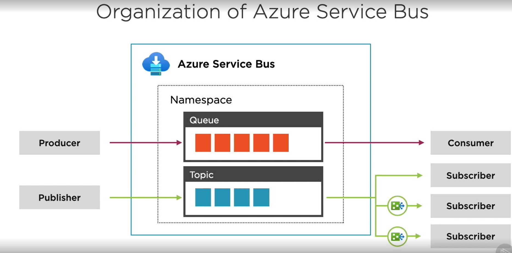
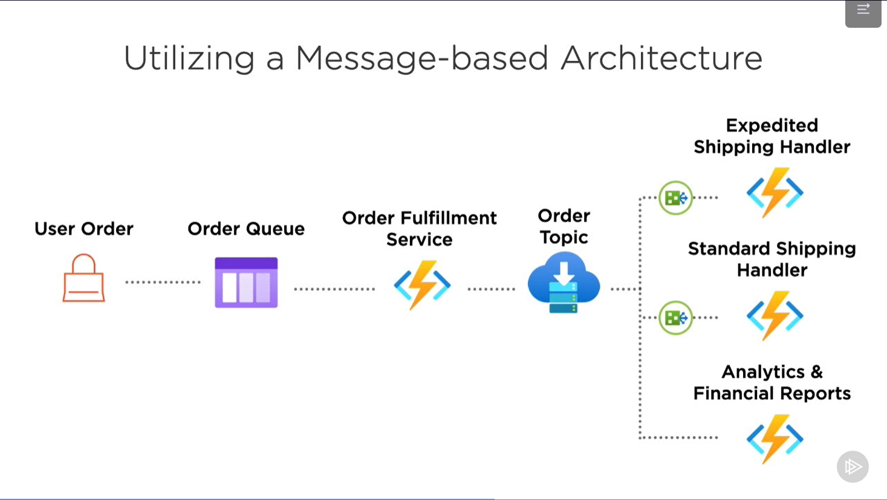

- Azure Service Bus for Application Messaging
  - Fully-managed enterprise Message Broker Service
  - enables multiple nodes of messaging
  - with integration for common messaging systems
    - including Java Message Service(JMS).
  - 
    - Azure Service Bus -> Namespace -> Queue: Producer and Consumer 
    - Azure Service Bus -> Namespace -> Topic: Publisher and multiple subscribers.
  - Features of Azure Service Bus
    - Supports HTTP/HTTPS and AMQP (Advanced Message Queuing Protocol) protocols
    - Includes messages for both queues and topics
    - Supports 3 different performance tiers:
      - ***Basic***
        - supports only queue(not topics)
      - ***Standard***
        - recommended option
        - pay as you go
        - throughput and latency are variable
        - utilizes shared resources
        - provides automatic scaling
        - supports message up to 256 KB
        - does not support geo-disaster recovery or availability zones.
      - ***Premium***
        - for prod envs
        - supports redundancy 
        - provides disaster recovery
        - Fixed pricing based on messaging units 
        - Fixed throughput based on messaging units
        - utilises dedicated resources
        - requires configuration of scaling rules
        - supports message size up to 1 MB
        - does support geo-disaster recovery or availability zones.
    - Supports advanced configurability:
      - Message Ordering
        - process in order they were received
      - Batching
        - batch process multiple messages at one time
      - ***DLQ: Dead-letter Queue***
        - for both queue or topic 
        - helps capture messages that were not processed during their lifetime
        - and act accordingly with those messages
      - Duplicate detection
        - detect if the message is already being used by another process/consumer
  - Service Bus URL Structure
    - https://namespace.servicebus.windows.net/queue_or_topic_name
  - Message Ordering
    - FIFO order
    - uses sessions to maintain FIFO
    - supported in queues and topics
      - but must be enabled first
  - Scaling Azure Service Bus
    - standard tier namespaces support partitioning of queues and topics
    - partitioning is ***not supported in premium tier namespaces***
    - partitioning enables separate messaging stores and brokers for a single entity
    - partitioning queues and topics can use a partition key to determine the partition.
    - without a partition key, round-robin algo is used by Azure.
- [Azure service_bus CLI Commands](service_bus.sh)
- Demo
  - Portal -> Service Bus -> Add -> namespace -> standard tier -> Queues and Topics
- Utilizing Azure Service Bus Topics
  - 
    - multiple subscribers
    - consumers subscribe to a topic based on the below filters
    - sender publishes messages to the topic
    - Asynchronously, receivers get their own copy of the message.
    - subscriptions are independent
      - i.e. it allows for many independent "taps" into a message stream
    - subscription = dedicated queue for a subscriber with configuration options
    - Filters used to get messages based on condition:
      - Boolean filters
        - specifies if all or none of the messages are selected 
      - SQL filters
        - sql-like expression to evaluate against message properties
      - Correlation filters
        - match against properties in the message
    - [topics_cli](topics_cli.sh)
- Demo(topics)
  - Portal -> service bus namespace -> topics -> + Topic
- Premium vs Standard Tiers
  - Premium
    - High throughput
    - Predictable performance
    - fixed pricing
    - ability to scale workload up and down
    - messages up to 1 MB
  - Standard
    - Variable throughput
    - variable latency
    - pay as you go(variable pricing)
    - no scaling
    - messages up to 256 KB
- Queue service components:
  - URL format
  - Storage
  - Queue
  - Message
