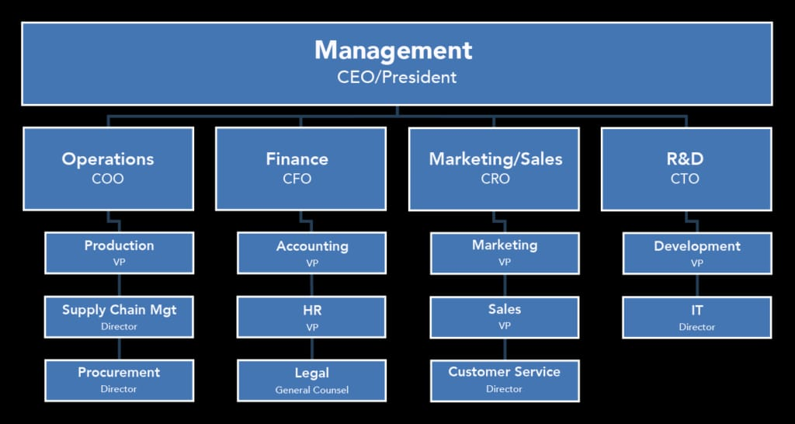

- Functional areas of business
  - 
    - Management: Planning, Organizing, Leading, Controlling
      - Finance
        - Accounting
        - Procurement
        - HR
      - Marketing
        - Marketing
        - Sales
        - Customer Service
      - Operations
        - Production
        - Supply Chain
        - Logistics
      - R&D
        - Development, Engineering, Technology (IT)
      - Legal
- Other broad level types of teams:
  - Functional
  - Project
  - Divisional
  - Virtual/Remote
  - Finance
  - Marketing
  - Cross-functional
  - Self-managed
- Types of teams in IT
  - Development
    - developer/Software Engineer
  - IT Operations (IT Ops)
    - Cloud Computing, Infrastructure
  - DevOps
  - SRE
    - Site Reliability Engineering
    - automation
  - Scrum
    - Agile
  - QA(Quality Assurance)/Testing
  - Support
    - resolving technical issues for IT users - internal and external customers
  - Security
    - Cybersecurity
  - Process
    - cross-functional Dev + Ops
  - Tiger
    - Incident Management
  - Virtual
    - Offsite/Remote
